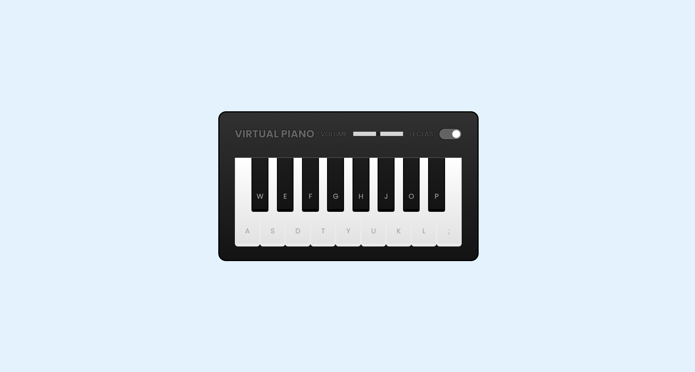

<h1 align="center"> Desafio da DIO - Simulador de piano</h1>

 

  

## 🚀 Tecnologias

Esse projeto foi desenvolvido com as seguintes tecnologias:

- HTML, CSS e JavaScript
- Git e Github

## 💻 Projeto

Um simulador de piano!

- [Para ver no site](https://lupyeah.github.io/Piano-virtual/)

## 📋 Funcionalidades

- 📌 Um piano virtual!
---
